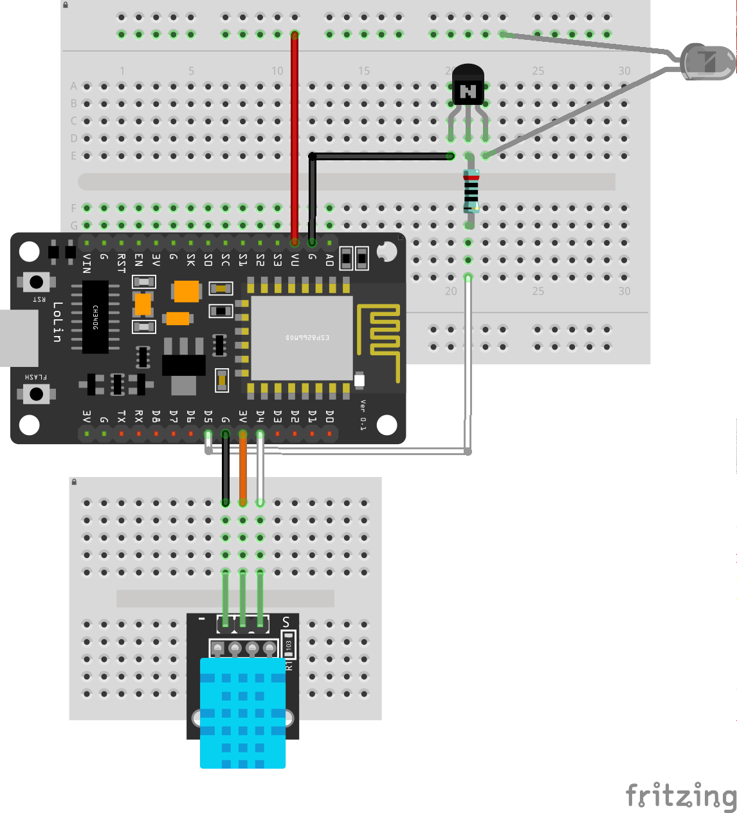

# office-aircon
Aircon control for the office. Based on NodeMCU and ESP8266.

## Build

Development

    platformio lib update # Download dependencies
    ./watch.sh

Deploy

    # Wired
    platformio run --target upload

    # Wireless
    platformio run --target upload --upload-port AirconClient-1.local

Watch

    platformio device monitor

## Settings

Update `private.sh` with settings and set `FIRST_TIME_SETUP` to true.

## Circuit

## Useful Resources

 - OTA over MQTT: https://github.com/Imroy/pubsubclient/blob/master/examples/ESP8266-OTA/ESP8266-OTA.ino
 - ESP8266-specific MQTT framework: https://github.com/marvinroger/homie-esp8266
